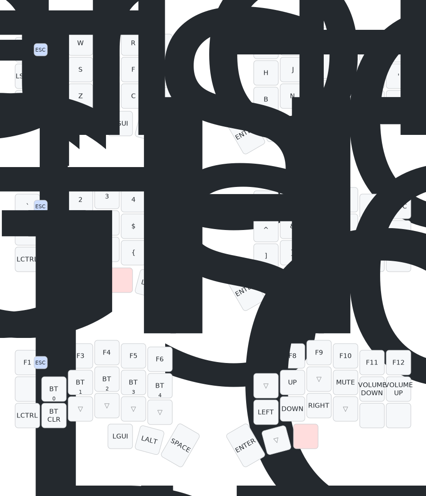

The ZMK keymap for my Corne keyboard was created using [Keymap Editor](https://nickcoutsos.github.io/keymap-editor/).

> Drawn with [Keymap Drawer]([/caksoylar/keymap-drawer](https://keymap-drawer.streamlit.app/))
